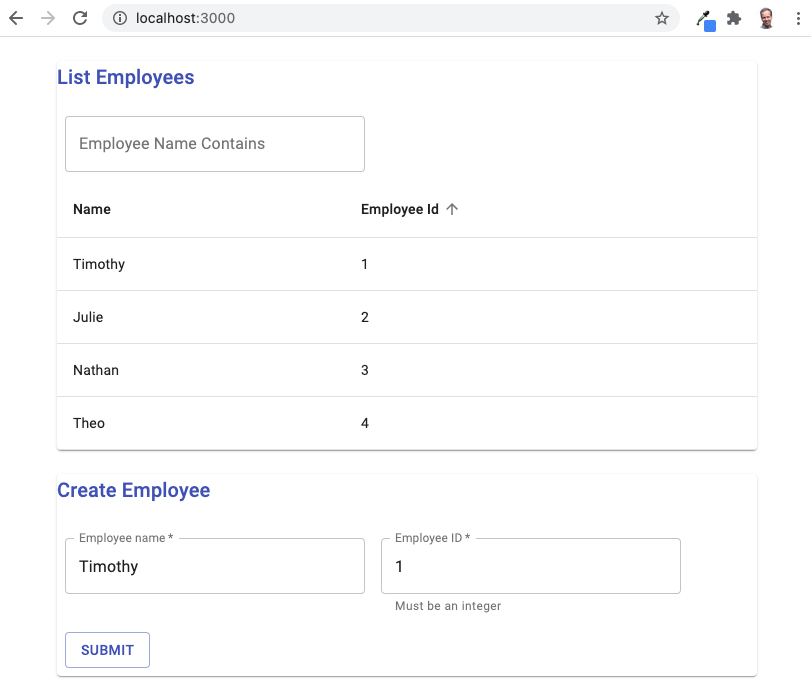
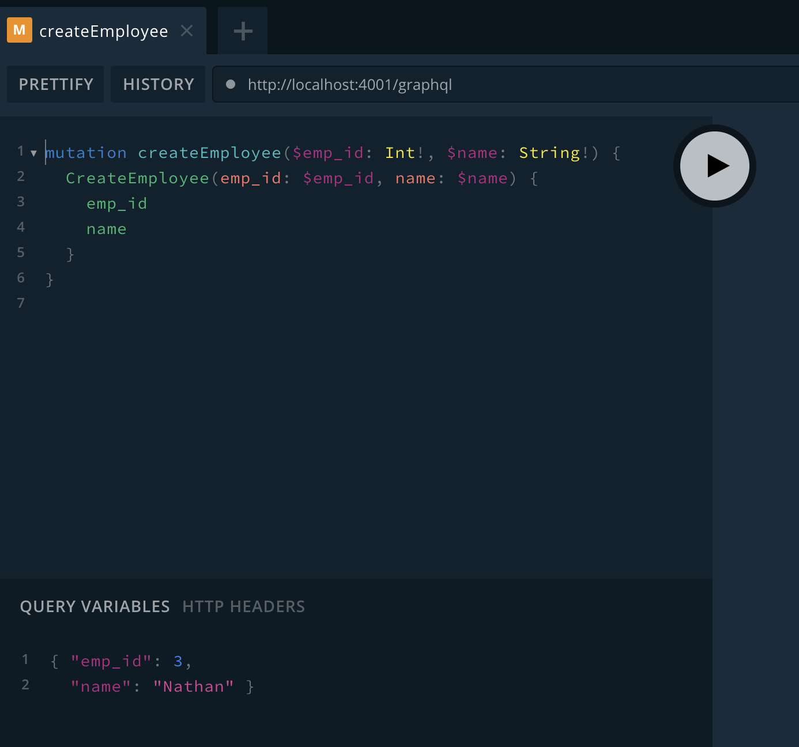

# Employee demo

This project demonstrates using a GraphQL API to create Employee nodes in Neo4j. The API supports two operations:

1. Create an Employee node. The operation accepts name (string) and emp_id (integer) parameters that are created as properties on the Employee node.
2. Return all Employees to the client. 

This project is based on the [GRANDstack Starter](https://github.com/grand-stack/grand-stack-starter) 
application. Extensive documentation on the GRANDstack is 
available at https://grandstack.io and in the book 
[Full Stack GraphQL Applications with GRANDstack](https://www.manning.com/books/fullstack-graphql-applications-with-grandstack) 
by William Lyon. 

Employee demo modifies the GRANDstack Starter by updating the GraphQL schema in `api/src/graphql-schema.js` to represent 
employees instead of business reviews. The React components in `web-react/src` are considerably simplified from the GRANDstack 
starter UI to reflect only the two API operations. 

## Quickstart

The GRANDstack Starter describes many ways to deploy GRANDstack applications. The Employee demo was tested 
with Docker. To launch the API locally, [install Docker](https://docs.docker.com/get-docker/). Then, from a 
command line navigate to the Employee demo install directory and run:

`docker-compose up -d`

Docker will start a local Neo4j database, the GraphQL API server, and the web UI.

The web UI will be available via a web browser at the address `http://localhost:3000`

## GraphQL API

Employee demo includes the GraphQL Playground, which provides an easy interface for executing 
GraphQL queries and mutations.

In a web browser, navigate to https://localhost:4001/graphql to launch GraphQL Playground.

### Create a new employee
To create a new employee, set the query variables in the lower left part of the screen 
   following this pattern.

    { "emp_id": 3,
      "name": "Nathan" }

Enter this mutation in the upper left part of the screen.

    mutation createEmployee($emp_id: Int!, $name: String!) {
      CreateEmployee(emp_id: $emp_id, name: $name) {
        emp_id
        name
      }
    }

Press the play button to test the mutation. Use the `copy curl` button to copy a curl script to 
your clipboard that could be used to make this API call from a command line or shell script.

### List all employees

You can run this GraphQL query in GraphQL Playground to return all employees and their IDs.

    query listAllEmployees{
      Employee{
        emp_id
        name
      }
    }

The React component `./web-react/src/components/EmployeeList.js` demonstrates a slightly more 
complex GraphQL query listing employees with pagination, sorting, and filtering.

## Deploying to AWS ECS with Docker compose

[Amazon ECS and Docker compose](https://aws.amazon.com/blogs/containers/deploy-applications-on-amazon-ecs-using-docker-compose/)
offer one way to deploy Employee Demo to the cloud.

You will need an AWS account with [appropriate permissions](https://docs.docker.com/cloud/ecs-integration/). 

If you have not installed AWS CLI, [install it](https://docs.aws.amazon.com/cli/latest/userguide/install-cliv2.html), and
[create a named profile](https://docs.aws.amazon.com/cli/latest/userguide/cli-configure-profiles.html).

Create a Docker context for interacting with ECS.

    docker context create ecs myecscontext

When prompted, select your AWS profile.

Switch to your new Docker context.

    docker context use myecscontext

Docker compose will launch Employee Demo in ECS with this command.

    docker compose up

Note: The command is `docker compose up` in this context, not `docker-compose up` as when
you run on your local Docker environment.

You will see a cluster named employee-demo in the AWS web console under ECS.

To find the URL where the web UI is running, 
1. Open EC2 in the AWS console
2. Click Load balancers
3. Find your active load balancer with a name that starts with "emplo"
4. Copy the DNS name from the configuration section

This information is also available through the AWS CLI by running:
   
    aws elbv2 describe-load-balancers | grep DNSName

Paste the DNS name into a web browser and add port `:3000` at the end to open the 
Employee Demo web UI.
    